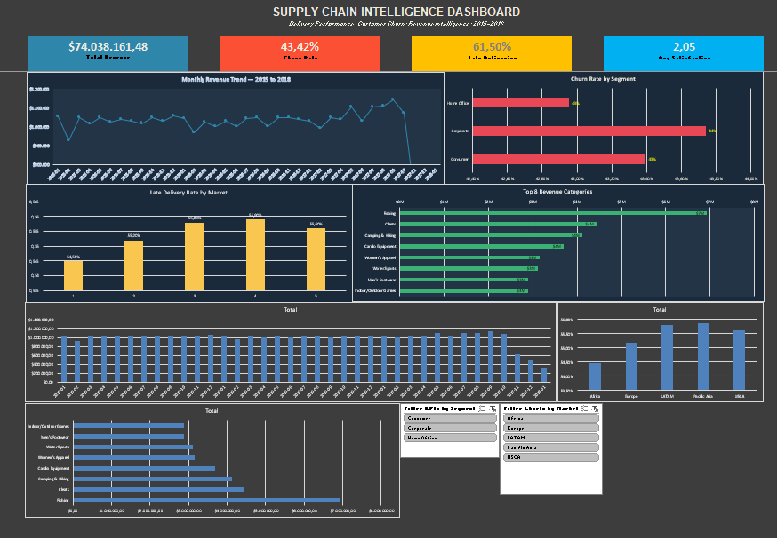

# 🌍 Supply Chain Intelligence & Customer Retention
**A Strategic Analytics Pipeline (SQL $\rightarrow$ Python $\rightarrow$ Excel)**

*An end-to-end data analysis project transforming 180,000+ raw global transaction records into a McKinsey-style C-Suite action plan, uncovering a $50M revenue leak.*

## 📥 Dashboard Download

### **[⬇️ Download Dashboard and Report (.xlsx)](https://www.dropbox.com/scl/fi/u7z3j757r51r8sowolwu9/Supply-Chains-Intelligence-Dashboard-YUVRAJ-SINGH-KUSHWAH.xlsx?rlkey=csst9x5426pd3w0wsq46ef1z9&st=no5fgvec&dl=0)**

---

 
*(Note: Replace with your REPORT sheet screenshot)*

## 🚨 The Business Crisis (BLUF)
Despite generating **$74M** in total revenue across 5 global markets, the business is facing a severe operational crisis. A staggering **61.5% of all orders are delivered late**. This logistical bottleneck is the primary driver behind a critical **43.4% customer churn rate**, placing an estimated $12M in future revenue at immediate risk.

## ⚙️ The Technical Pipeline
This project avoids "black box" dashboarding by building a robust, transparent, three-tier data architecture:

1. **Database Extraction (PostgreSQL):** Queried and joined the raw DataCo Global Operations dataset (180,519 rows, spanning 2015–2018) to isolate key supply chain and customer feedback tables.
2. **Data Aggregation & Analysis (Python/Pandas):** Engineered new features (Projected LTV, Revenue at Risk, Delay Days) and grouped the massive dataset into three optimized, lightweight relational tables: `Customer_Data`, `Monthly_Data`, and `Market_Data`.
3. **Interactive Visualization & Strategy (Advanced Excel):** Engineered a multi-engine PivotTable backend linked to an interactive dark-themed UI via macro-free slicers, capped off with a 1-page C-suite strategic report.

---

*(Note: Replace with your DASHBOARD sheet screenshot)*

## 🔍 Key Data-Driven Insights

> 🔴 **FINDING 1: Critical Revenue Loss ($50.7M)**
> * 8,967 out of 20,652 customers have churned from the platform.
> * The **Corporate segment** shows the highest churn rate at 44%, while the **Consumer segment** accounts for the largest absolute revenue loss ($6.2M CLV at risk).

> 🟡 **FINDING 2: Systemic Delivery Failure (61.5% Late)**
> * Late delivery is a global systemic failure, not a regional anomaly (all 5 markets show a 54-56% late rate).
> * **Pacific Asia (55.9%)** and **LATAM (55.8%)** are the worst-performing supply chain nodes.
> * Premium shipping ("First Class") suffers from the same delays, destroying customer trust (The Premium Paradox).

> 🔵 **FINDING 3: Customer Experience Collapse (2.05/5)**
> * The average customer satisfaction score has plummeted to an unacceptable 2.05/5.
> * Direct correlation mapped: *Late Deliveries $\rightarrow$ Lower Satisfaction $\rightarrow$ Higher Churn Probability.*

## ♟️ Strategic Action Plan (The "So What?")
Data without action is just trivia. Based on the analytical models, the following strategic roadmap was developed for executive execution:

| Priority | Action | Owner | Est. Business Impact | Timeline | Status |
| :--- | :--- | :--- | :--- | :--- | :--- |
| 🔴 **HIGH** | **Corporate Retention Program** (Dedicated account managers & contract incentives) | Sales & CX Team | **$3.7M Revenue Recovery** | Q1 2024 | ⏳ Pending |
| 🔴 **HIGH** | **Logistics SLA Renegotiation** (Pacific Asia & LATAM carriers) | Operations | **15-20% Late Delivery Reduction** | Q1 2024 | ⏳ Pending |
| 🟡 **MEDIUM** | **Satisfaction Recovery Program** (Automated discount/apology systems) | CX Team | **12% Churn Risk Reduction** | Q2 2024 | ⏳ Pending |
| 🟡 **MEDIUM** | **Real-time Tracking System Implementation** | Tech Team | **2x Satisfaction Score** | Q2 2024 | ⏳ Pending |
| 🟢 **LOW** | **High-Value Category Protection** (Decentralize inventory for Fishing/Cleats) | Product Team | **$6.9M Revenue Protected** | Q3 2024 | ⏳ Pending |

---

## 📂 Repository Structure
* `/data`: Contains the Python-aggregated `.csv` files (`Customer_Data`, `Monthly_Data`, `Market_Data`).
* `/scripts`: Python (`.py` / `.ipynb`) scripts used for data cleaning, EDA, and aggregation.
* `/sql`: PostgreSQL queries used for the initial data extraction and joining.
* `Supply_Chain_Intelligence_Yuvraj.xlsx`: The final compiled Excel workbook featuring the interactive dashboard and dynamic C-suite report.

## 👨‍💻 Author
**Yuvraj Singh Kushwah**
*Data Scientist & AI Innovator*
* [LinkedIn](https://www.linkedin.com/in/yuvraj-singh-kushwah-2b88b8366/) 
* [Portfolio/GitHub](https://github.com/YUVRAJ-NOVA) 

> *"Bridging the gap between raw database architecture and executive decision-making."*
